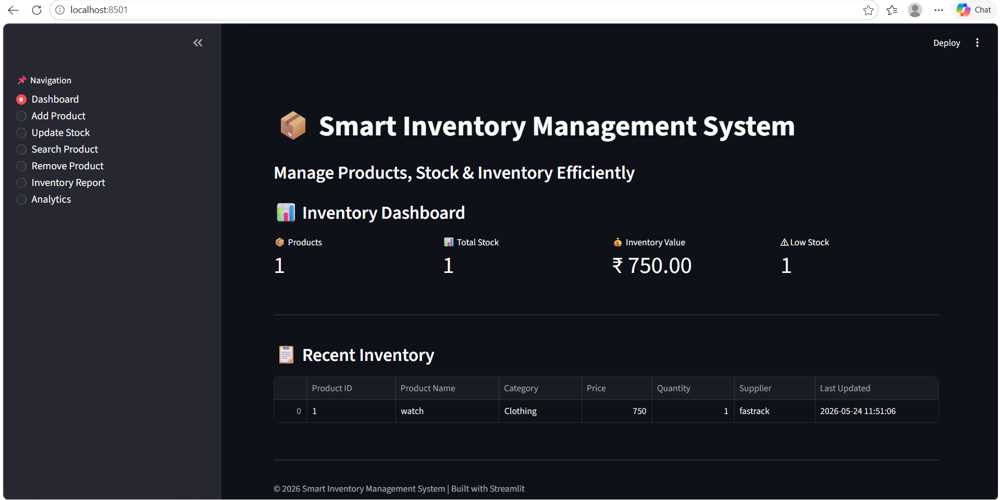

# 📦 Smart Inventory Management System

A modern and interactive **Inventory Management System** built using **Python, Streamlit, Pandas, and NumPy** to help businesses efficiently manage products, monitor stock levels, analyze inventory performance, and generate real-time reports.

This project demonstrates practical implementation of **data management, analytics dashboards, CRUD operations, and business intelligence visualization** in a user-friendly web application.

---




---

## 🚀 Key Features

### 📌 Inventory Operations

* Add new products with validation
* Update product stock levels
* Remove inventory items safely
* Search products dynamically
* Prevent duplicate product entries

### 📊 Dashboard & Analytics

* Real-time inventory overview
* Total inventory value calculation
* Low stock monitoring system
* Product quantity analysis
* Inventory value analytics
* Interactive charts and data tables

### 📑 Reporting

* Download inventory reports as CSV
* Auto-updated inventory records
* Timestamp tracking for stock updates

### ⚡ User Experience

* Interactive Streamlit UI
* Fast and responsive dashboard
* Clean and intuitive design

---

# 🛠️ Tech Stack

| Technology | Purpose                    |
| ---------- | -------------------------- |
| Python     | Core Programming           |
| Streamlit  | Web Application Framework  |
| Pandas     | Data Processing & Analysis |
| NumPy      | Numerical Computation      |

---

# 📂 Project Structure

```bash
smart-inventory-management-system/
│
├── app.py
├── Dashboard.png
├── requirements.txt
├── README.md
```

---

# ⚙️ Installation & Setup

## 1️⃣ Clone the Repository

```bash
git clone https://github.com/Chowdri-Furkhan07/inventory-analytics-dashboard.git
```

## 2️⃣ Navigate to the Project Directory

```bash
cd inventory-analytics-dashboard
```

## 3️⃣ Create Virtual Environment (Optional)

### Windows

```bash
python -m venv venv
venv\Scripts\activate
```

### Linux / Mac

```bash
python3 -m venv venv
source venv/bin/activate
```

---

# 📥 Install Dependencies

```bash
pip install -r requirements.txt
```

---

# ▶️ Run the Application

```bash
streamlit run app.py
```

---

# 📊 Dashboard Modules

## 📌 Dashboard

* Total Products
* Total Stock
* Inventory Value
* Low Stock Alerts

## ➕ Add Product

* Product entry validation
* Duplicate prevention
* Product information management

## 🔄 Update Stock

* Modify inventory quantity
* Real-time stock updates
* Automatic timestamp tracking

## 🔍 Search Products

* Dynamic product filtering
* Quick inventory lookup

## ❌ Remove Product

* Safe inventory deletion

## 📑 Inventory Reports

* CSV export functionality
* Downloadable inventory reports

## 📈 Analytics

* Stock quantity analysis
* Inventory value insights
* Low stock monitoring

---

# 🌐 Deployment

The application is deployed using **Streamlit Cloud**.

# Live Demo

🚀 Experience the live application here:

👉 [Smart Inventory Management System](https://inventory-analytics-dashboard-2vfata2qg8eahqkrr8jcjh.streamlit.app/)

---

### 📌 Features Available in Live Demo

* Real-time Inventory Dashboard
* Product Management
* Stock Monitoring
* Inventory Analytics
* CSV Report Download
* Interactive Data Visualization


---

# 🔒 Future Enhancements

* 🔐 User Authentication System
* 🗄️ MySQL/PostgreSQL Database Integration
* 📷 Barcode Scanner Integration
* 🧾 Supplier Management System
* 💳 Sales & Billing Module
* ☁️ Cloud Deployment Enhancements
* 🤖 AI-Based Inventory Forecasting
* 📱 Mobile Responsive UI

---

# 💡 Project Highlights

* Developed a fully functional inventory management solution using Python
* Implemented CRUD operations for real-time inventory handling
* Built interactive business analytics dashboards using Streamlit
* Enabled CSV report generation for inventory tracking
* Designed low stock alert mechanisms for inventory optimization

---

# 👩‍💻 Author

**Chowdri Furkhan**

AI/ML Engineer | Data Science Enthusiast

---

# 📄 License

This project is licensed under the **MIT License**.

---

# ⭐ Support

If you found this project useful, consider giving it a ⭐ on GitHub.
